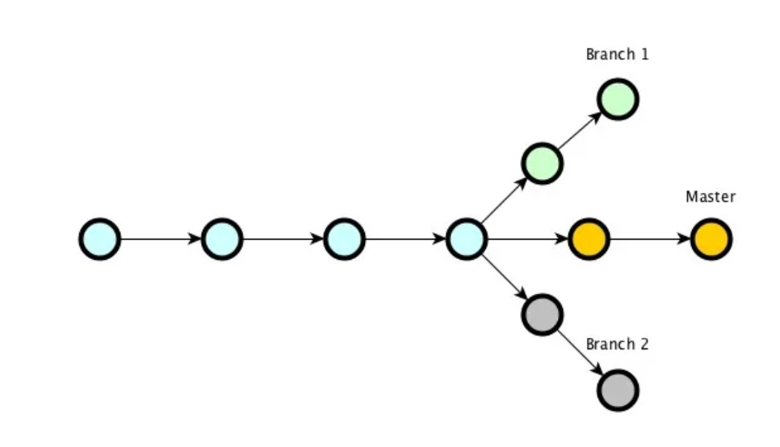

## Основные комманды первого семинара по GIT

>**git init** - *инициализация локального репозитория*

>**git status** - *получить информацию от git о текущем состоянии*

>**git add** - *добавить файл или файлы к следующему коммиту*

>**git log** - *посмотреть журнал коммитов*

>**git commit -m"message"** - *создание коммита*

>**git checkout** - *переход от одного коммита к другому*

>**git checkout master** - *вернуться к актуальному состоянию и продолжить работу*

>**git diff** - *увидеть разницу между текущим файлом и закоммиченным файлом*

[Рабочий процесс с менеджером](https://www.google.com/url?sa=i&url=https%3A%2F%2Fedt.1c.ru%2Fupload%2Fdocs_git%2Ftopics%2Ft000019.html&psig=AOvVaw2wB6a0qW_oz2R-SzO07pnJ&ust=1679668137702000&source=images&cd=vfe&ved=0CBAQjRxqFwoTCJjp49al8v0CFQAAAAAdAAAAABAJ)
>Так как Git позволяет иметь несколько удалённых репозиториев, можно работать так, чтобы каждый разработчик имел права на запись в свой собственный публичный репозиторий, и права на чтение для всех остальных репозиториев. Этот сценарий часто подразумевает существование основного репозитория, который представляет собой "официальный" проект.

>Чтобы принять участие в работе над таким проектом, вы должны создать свою собственную публичную копию основного репозитория и выложить туда свои изменения. Потом вы можете отправить запрос менеджеру на то, чтобы он внёс ваши изменения в основной репозиторий. Менеджер может добавить ваш публичный репозиторий себе в качестве удалённого, протестировать локально ваши изменения, слить их со своей веткой, и затем отправить в основной репозиторий. Этот процесс осуществляется следующим образом:

>Руководитель проекта отправляет файлы в основной репозиторий.
Разработчик клонирует этот репозиторий и делает свои изменения.
Разработчик отправляет изменения в свой публичный репозиторий.
Разработчик отправляет менеджеру письмо с просьбой внести его изменения в проект.
Менеджер добавляет публичный репозиторий разработчика как удалённый, и локально выполняет слияние.
Менеджер отправляет слитые изменения в основной репозиторий.

## Основные комманды второго семинара по GIT

git commit -am "